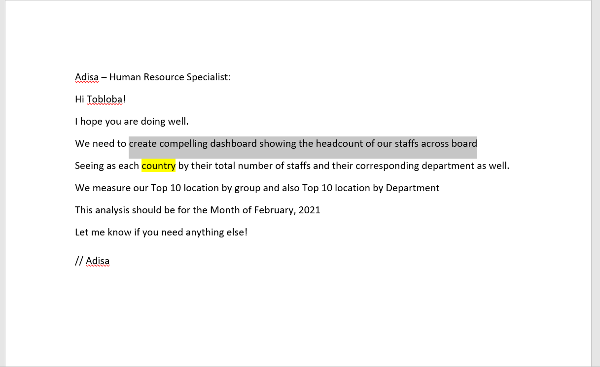
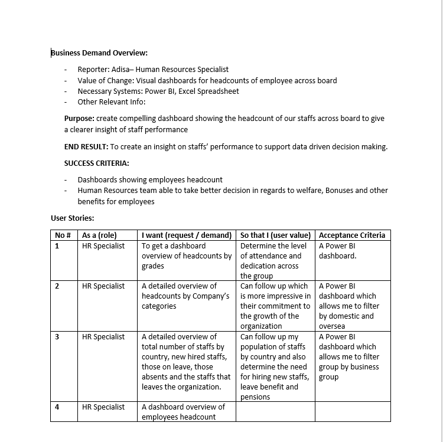
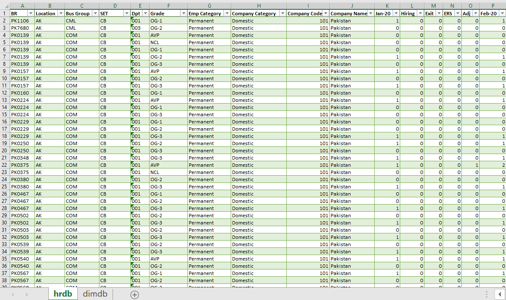
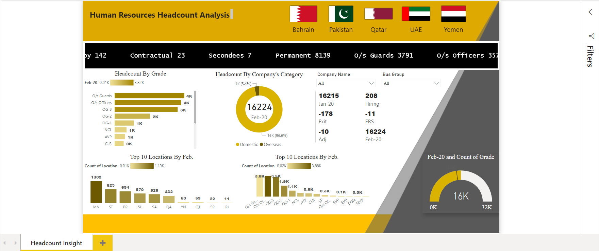

# HeadsCountInsight
# DataAnalysisUsingPowerBI-
<h2>Business Request & User Stories</h2> 
The business request for the data analyst to create a headcounts insight for HR Specialist. 
Based on the request that was made from the business we following user stories were defined to fulfill delivery and ensure that acceptance criteria’s were maintained throughout the project.  

 

 
<h2>Data Cleansing & Transformation SQL</h2>
 
One data source (employees headcounts) were provided in Excel format and were connected in the data model in a later step of the process.
Below are the excel sheets for cleansing and transforming necessary data.
 

<h2>Data Model</h2>
 
Below is a screenshot of the data model after cleansed and prepared tables were read into Power BI.
 
 

 
<h2>Key Insight Dashboard</h2>
 

